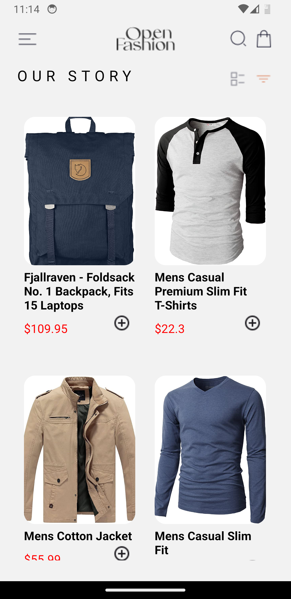
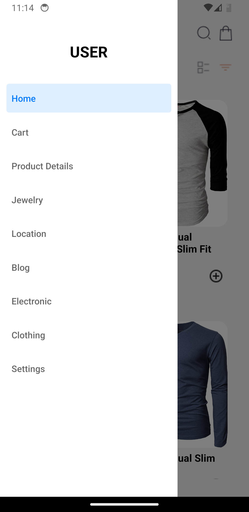
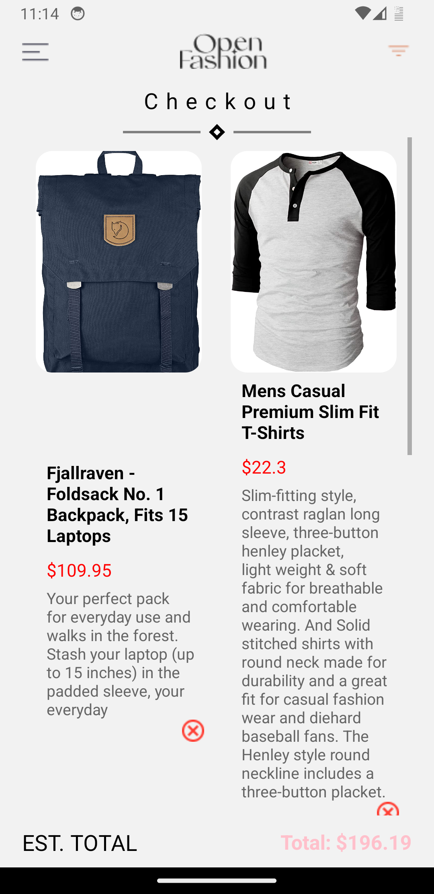
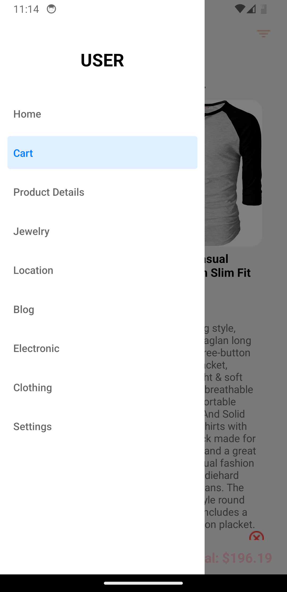
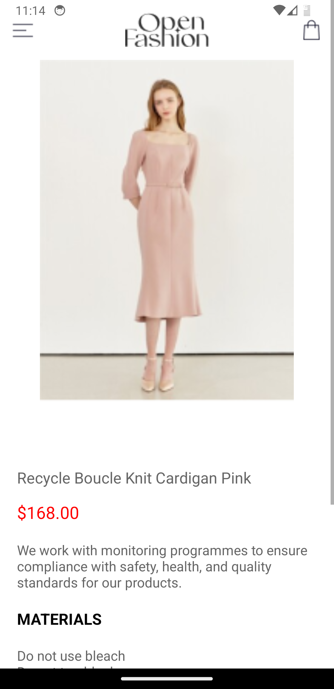
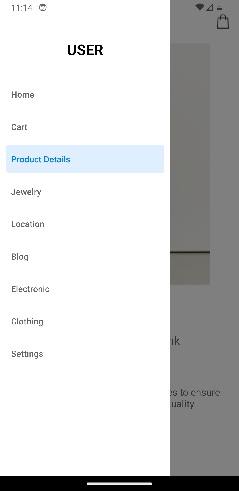
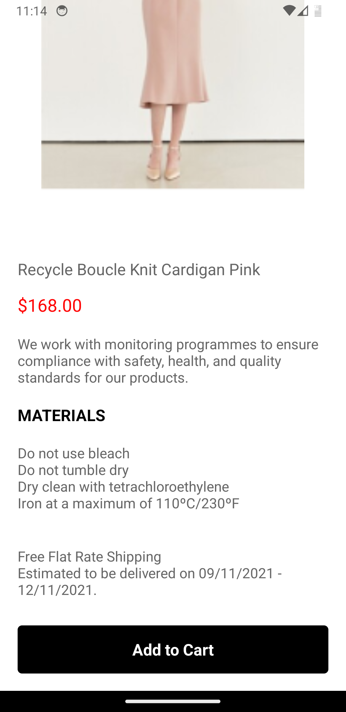

# rn-assignment7-11333392

React Native UI mockup using expo. Incorporating external links and using storage systems

# Fashion App

A mobile application UI mockup built with React Native that showcases a fashion store with product listings, product details, and a shopping cart.

## Features

- **Product Listing:** Fetches products from Fake Store API and displays them in a grid layout.
- **Product Detail:** Displays detailed information about the selected product.
- **Shopping Cart:** Add products to the cart and view them on the cart screen.
- **Drawer Navigation:** Custom drawer navigation for easy access to different sections.

## Usage

- **Home Screen:** Displays a list of products fetched from the API. Click on a product to view its details.
- **Product Detail Screen:** Shows detailed information about the selected product and allows adding it to the cart.
- **Cart Screen:** Displays products added to the cart.

## Project Structure

- **`/assets`**: Contains image assets used in the app.
- **`/components`**: Contains reusable UI components.
- **`/screens`**: Contains the main screens (Home, ProductDetail, Cart).

## Dependencies

- **React Navigation:** For navigation and drawer management.
- **React Native Gesture Handler:** For handling gestures.
- **React Native Reanimated:** For animations.
- **AsyncStorage:** For storing cart data locally.

## Screenshots

      
